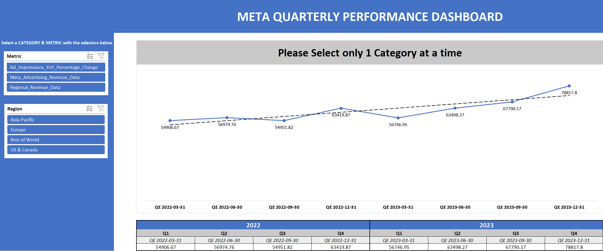

# 🌐 Meta Quarterly Performance Dashboard

## 📌 Overview
An interactive Excel dashboard analyzing Meta’s advertising and regional revenue metrics on a quarterly basis across global regions — **Asia-Pacific, Europe, US & Canada, and Rest of World**. The tool provides a metric-selector and region filter, allowing focused trend analysis between 2022 and 2023.

---

## 🛠️ Tools Used
- Microsoft Excel
- Slicers (Metric & Region filters)
- Line Charts & Trendlines
- Conditional Formatting
- Pivot Tables

---

## 📊 Key Features
- Visual quarterly trendline analysis for Meta revenue data
- Region-wise breakdown across 4 global markets
- Metric selector for:
  - Ad Impressions YoY %
  - Meta Advertising Revenue
  - Regional Revenue Data
- Dynamic chart updates and clean table summaries

---

## 📈 Insights
- Enables marketing and finance teams to track growth or dips in ad-related metrics over time
- Supports strategic comparisons across regions and metrics
- Visual trendline helps identify performance trajectory

---

## 🔗 View File  
[📂 Click here to open the Excel dashboard](https://github.com/prakshalishah/meta-quarterly-performance-dashboard/blob/main/Meta_Quarterly_Performance_Dashboard.xlsx)

---

## 📷 Preview

 
